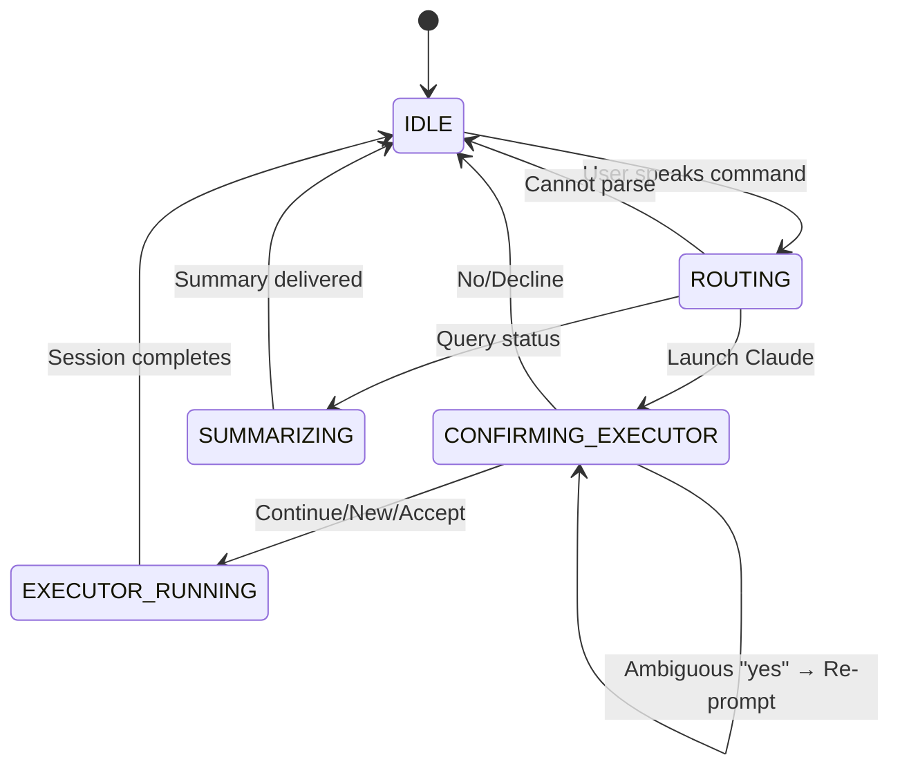

# Orchestrator

## State Machine



### States

- **IDLE**: Awaiting user input
- **ROUTING**: LLM analyzing user intent  
- **CONFIRMING_EXECUTOR**: Awaiting session confirmation (continue/new/no)
- **EXECUTOR_RUNNING**: Claude actively working
- **SUMMARIZING**: Generating status summary

## Example User Story

### Sarah's Debugging Session

**8:45 AM - First Session**

Sarah: *"Help me debug the authentication error in the login flow"*

System routes through LLM → Launch Claude decision

System: *"Should I start Claude for: debug the authentication error in the login flow?"*  
*"Say 'yes' or 'no'"* (No previous session exists)

Sarah: *"Yes"*

System starts new Claude session (ID: 20241203_084512_abc123)  
Claude begins debugging, finds issue in JWT validation, implements fix  
Session completes after 12 minutes

---

**10:30 AM - Continuation**

Sarah: *"I need to add rate limiting to the auth endpoints"*

System: *"Should I start Claude for: add rate limiting to the auth endpoints?"*  
*"Previous: Fixed JWT validation in login flow (1h 45m ago)"*  
*"Say 'continue', 'new', or 'no'"*

Sarah: *"Yes"* (ambiguous)

System: *"🤔 Would you like to:*  
*• Continue previous (Fixed JWT validation...)?*  
*• Start new session?*  
*• Cancel?*  
*Say 'continue', 'new', or 'no'"*

Sarah: *"Continue where we left off"*

System: *"✓ Continuing previous session (abc123)"*  
Launches: `claude -p --resume 20241203_084512_abc123 "add rate limiting to the auth endpoints"`

Claude resumes with full context from the authentication debugging session, knows about the JWT fix, understands the codebase structure, and implements rate limiting that integrates properly with the previous changes.

---

**10:45 AM - Status Check**

Sarah: *"What's happening?"*

System: *"Current session (ID: abc123, running for 15m): Claude is implementing rate limiting middleware using Redis for the /api/auth endpoints, currently writing tests for login throttling"*

---

**Session Metadata Saved:**
```json
{
  "session_id": "20241203_084512_abc123",
  "status": "completed",
  "summary": "Fixed JWT validation, added rate limiting to auth endpoints",
  "completed_at": "2024-12-03T11:05:22Z",
  "is_resumed": true,
  "resumed_from": "20241203_084512_abc123",
  "duration_secs": 1810
}
```